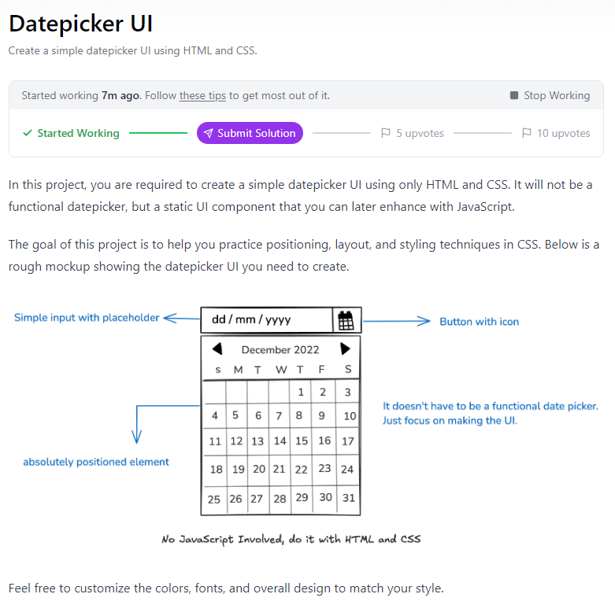
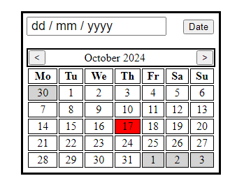

# roadmap

The task is about making a datepicker UI solely with the use of CSS and HTML.
No functionality needed but I tried out what was possible and added an onclick selection to the day list elements.

The result:

